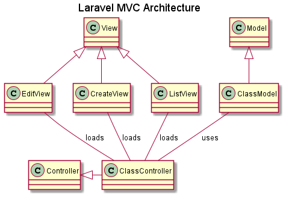

# CRUD8

Initialy a CRUD using Laravel 8.x and PHP 8.

The project is evolving to include a basic infrastructure for a generic Web application. The idea is to first develop everything common to multiple Web applications and then to fork it and complete it with business logic. Once this project is available it should be extremely fast to derive real WEB application from it. 

The infrastructure should support:

* A basic CRUD example
* Unit tests, Feature tests, browser controlled tests
* Authentication and roles management
* usage of datatable
* CSV and pdf export
* file attachment to database items
* Calendar and email support
* Datatable
* API support for Android clients
* Multi languages and localisation
* Basic documentation for development, design, specification and user documentation

## Sources and inspiration

[Laravel 8 CRUD tutorial](https://appdividend.com/2020/10/13/laravel-8-crud-tutorial-example-step-by-step-from-scratch/)
    
[Markdown cheat sheet](https://github.com/adam-p/markdown-here/wiki/Markdown-Cheatsheet)

## Steps

###  Install Laravel

    composer create-project laravel/laravel --prefer-dist crud8
    
check

    http://localhost/crud8/public
    

### Edit the .env file to set database identifiers

### Create the MySql database and a matching user

### Laravel application Architecture

### Create the model

    php artisan make:model Game -m
    Add nex files in the migration class up method
    php artisan migrate

### Create a controller

    php artisan make:controller GameController --resource
    
edit the boot method into App\Providers\RouteServiceProvider.php 

    Route::middleware('web')
                ->namespace('App\Http\Controllers')
                ->group(base_path('routes/web.php'));
                
### Define the routes

in routes\web.php
    Route::resource('games', 'GameController');

and check it

    php artisan route:list
    
    >php artisan route:list
    +--------+-----------+-------------------+---------------+---------------------------------------------+------------+
    | Domain | Method    | URI               | Name          | Action                                      | Middleware |
    +--------+-----------+-------------------+---------------+---------------------------------------------+------------+
    |        | GET|HEAD  | /                 |               | Closure                                     | web        |
    |        | GET|HEAD  | api/user          |               | Closure                                     | api        |
    |        |           |                   |               |                                             | auth:api   |
    |        | GET|HEAD  | games             | games.index   | App\Http\Controllers\GameController@index   | web        |
    |        | POST      | games             | games.store   | App\Http\Controllers\GameController@store   | web        |
    |        | GET|HEAD  | games/create      | games.create  | App\Http\Controllers\GameController@create  | web        |
    |        | GET|HEAD  | games/{game}      | games.show    | App\Http\Controllers\GameController@show    | web        |
    |        | PUT|PATCH | games/{game}      | games.update  | App\Http\Controllers\GameController@update  | web        |
    |        | DELETE    | games/{game}      | games.destroy | App\Http\Controllers\GameController@destroy | web        |
    |        | GET|HEAD  | games/{game}/edit | games.edit    | App\Http\Controllers\GameController@edit    | web        |
    +--------+-----------+-------------------+---------------+---------------------------------------------+------------+
    
### Configure bootstrap

    composer require laravel/ui
    php artisan ui bootstrap
    npm install && npm run dev
    
some errors

    npm WARN notsup SKIPPING OPTIONAL DEPENDENCY: Unsupported platform for fsevents@2.3.2: wanted {"os":"darwin","arch":"any"} (current: {"os":"win32","arch":"x64"})

    npm ERR! code ENOENT
    npm ERR! syscall rename
    npm ERR! path C:\Users\frederic\Dropbox\xampp\htdocs\crud8\node_modules\@babel\helper-explode-assignable-expression
    npm ERR! dest C:\Users\frederic\Dropbox\xampp\htdocs\crud8\node_modules\@babel\.helper-explode-assignable-expression.DELETE
    npm ERR! errno -4058
    npm ERR! enoent ENOENT: no such file or directory, rename 'C:\Users\frederic\Dropbox\xampp\htdocs\crud8\node_modules\@babel\helper-explode-assignable-expression' -> 'C:\Users\frederic\Dropbox\xampp\htdocs\crud8\node_modules\@babel\.helper-explode-assignable-expression.DELETE'
    npm ERR! enoent This is related to npm not being able to find a file.
    npm ERR! enoent

    npm ERR! A complete log of this run can be found in:
    npm ERR!     C:\Users\frederic\AppData\Roaming\npm-cache\_logs\2021-05-12T09_30_21_312Z-debug.log

to fix:

    rm -rf node_modules
    rm package-lock.json yarn.lock
    npm cache clear --force
    npm install
    npm run dev

### Create Views in Laravel 8

### Add Validation rules and store the data.

test with empty fields

    http://localhost/crud8/public/games/create
    
## Local testing

### Unit tests

### Browser control tests

## Documentation

### Design documentation

The design documentation is under the project doc directory. It is a set of markdown files. Plantuml is used for UML diagrams. Images are generated and shared in the same directory so the documentation is directly readable from github.

### PHP code documentation

The code is documented using DocBlocks for PHPDocumentor.

    https://docs.phpdoc.org/3.0/guide/getting-started/what-is-a-docblock.html
    

## Continuous integration

### Jenkins server

### Static analysis

